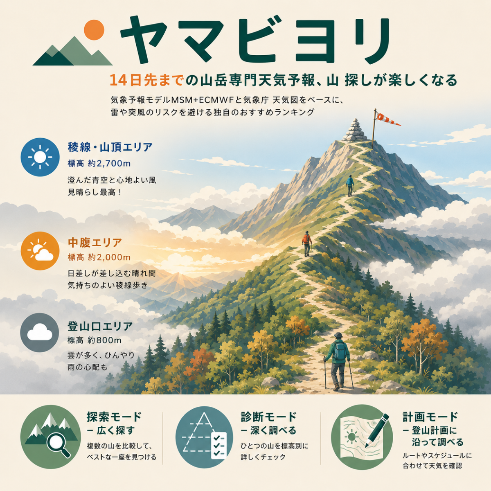

# ヤマビヨリ (Mountain Weather)



Open-Meteoの無料APIだけで動く、登山特化型の天気予報ツール。気象庁MSM(近距離・高精度)とECMWF IFS(全球・14日先まで)を自動マージし、雷リスク・稜線風・稜線雲量・視程・降水・体感温度(風冷+濡れ補正)を重み付けした登山向け総合スコアを算出する。

## できること

- **探索モード**(`mountain_weather_mvp.py`) — 候補75座を横断的にスコア比較し、週末の狙い目を探す(非対話)。
- **診断モード**(`mountain_weather_detail.py`、山選択) — 1つの山を14日分、標高別(地上/1000m/2000m/3000m/山頂 — 気圧面をジオポテンシャル高度で各標高へ補間)・時間帯別に詳細診断する(対話式)。
- **GPXルート診断**(`mountain_weather_detail.py`、GPXモード) — ヤマレコの登山計画書GPXから登山口・山小屋・山頂などの地点を自動抽出し、地点ごとの標高に応じた気圧面で天気を評価。オプションで地図PNGも生成できる。

## セットアップ

```bash
python -m venv venv
./venv/Scripts/python.exe -m pip install -r requirements.txt
```

中核機能の依存は `requests` のみ。`mountain_weather_detail.py` のオプション機能(気象庁天気図スクリーンショット/ルート天気マップPNG)を使う場合は `requirements.txt` 内のコメントを参照し、`playwright`/`Pillow` を追加でインストールすること(`playwright` はブラウザバイナリの取得 `playwright install chromium` も必要)。

## 使い方

```bash
# 探索モード: 全山ランキング(非対話)
./venv/Scripts/python.exe mountain_weather_mvp.py

# 診断モード: 対話的に山を選択
./venv/Scripts/python.exe mountain_weather_detail.py

# 診断モード: 非対話(モード1 = 山を選んで診断、番号は一覧で要確認)
echo "1
12" | ./venv/Scripts/python.exe mountain_weather_detail.py
```

## ファイル構成

- `.claude-plugin/plugin.json` — Claude Codeプラグインのマニフェスト。
- `.claude-plugin/marketplace.json` — このリポジトリ自体をプライベートマーケットプレイスとして配布するための定義(`source: "./"`でリポジトリ直下を唯一のプラグインとして指す)。
- `skills/yamabiyori/SKILL.md` — Claude Code向けのスキル定義・設計ドキュメント本体。
- `mountain_weather_core.py` — 探索モード・診断モードが共有する土台モジュール(山リスト、気圧面変換、スコア算出ロジック、Open-Meteoレスポンスのディスクキャッシュ)。単体では実行しない。
- `mountain_weather_mvp.py` — 探索モード本体。
- `mountain_weather_detail.py` — 診断モード(山選択・GPXルート診断)本体。
- `assets/` — README用のバナー画像など。
- `cache/` — Open-Meteoレスポンスの生JSONキャッシュ(自動生成、3時間TTL)。
- `screenshots/`, `maps/` — オプション機能が生成するPNGの保存先(自動生成)。

## Claude Codeとの連携

このリポジトリはClaude Codeプラグインとして構成されている(`.claude-plugin/plugin.json`)。プラグインをインストールすると`skills/yamabiyori/SKILL.md`が自動で読み込まれ、「富士山の天気は?」「どこかいい山ない?」のような山の天気に関する質問に、Claude Codeがこのツールを自動実行して答えるようになる。

```bash
# このリポジトリをプライベートマーケットプレイスとして追加してインストールする場合
claude plugin marketplace add <このリポジトリのパスまたはURL>
/plugin install yamabiyori@yamabiyori-marketplace

# ローカルで動作確認だけしたい場合(マーケットプレイス登録不要)
claude --plugin-dir .
```

スクリプトを手動実行する以外に、Claude Codeとのチャットからそのまま使う使い方を想定している。

## 設計ドキュメント

スコア計算式の根拠、気圧面/標高バンドの扱い、GPXルート診断・地図PNG・ECMWFアンサンブル確信度・気象庁天気図スクリーンショットなど各機能の詳細な設計判断・既知の落とし穴は `skills/yamabiyori/SKILL.md` にまとめてある。

## 更新履歴

### v1.1.0 (2026-09-08)
- ランキングアルゴリズムを再設計。総合スコア(`mountain_climb_score`)は雲量・視程・降水の3要素を加重幾何平均(雲25%・視程25%・降水50%)で評価する方式に変更し、悪天候の一要素が他の良好な要素の平均で埋もれないようにした。雷(CAPE)・稜線風・低体温(wet-chill)リスクはスコアから切り離し、`mountain_hazards()`による独立した警戒レベル(注意/警戒/危険)として表示するようにした。
- 降水評価を「AM窓の単発確率」から「活動時間帯における時間単位の“濡れている割合”」ベースに変更し、通り雨と終日雨を区別できるようにした。
- 雲量評価を稜線滞在時間帯とPM下降時間帯の悪い方を採用するように拡張し、午後からの崩れを見逃さないようにした。
- 候補山に「棒ノ折山(棒ノ嶺)」を追加。

### v1.0.0
- 初版リリース(探索モード・診断モード・GPXルート診断)。

## ライセンス

[MIT License](LICENSE) — 無償・自由に利用・改変・再配布してよい。ただし本ツールが取得するOpen-Meteo・気象庁(MSM/天気図)・GSI(地理院タイル)のデータ自体は各提供元の利用規約に従うこと(詳細はSKILL.md参照)。
